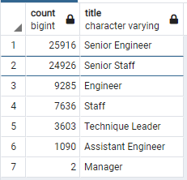
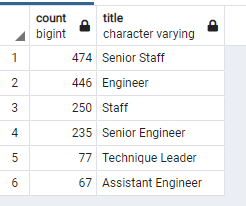

# Pewlett-Hackard-Analysis

## Challenge Overview
### Overview of the Pewlett Hackard Analysis

The purpose of this analysis was to analyze employees and determine how many employees have upcoming retirements (employees born between 1952-1955), as well as to identify employees that might be eligible to participate in a mentorship program (employees born in 1965).

## Results

- There are 1,549 employees eligible for the mentorship program (born in 1965).
- 72,458 employees are eligible for retirement.
- The majority of employees retiring are either Senior Engineers or Senior Staff:

- The majority of employees eligible for the mentorship program are Senior Staff or Engineers: 

## Summary
- Potentially 72,458 roles will need to be filled.
- Based on this analysis, there are sufficient employees ready to retire in each department able to mentor.

